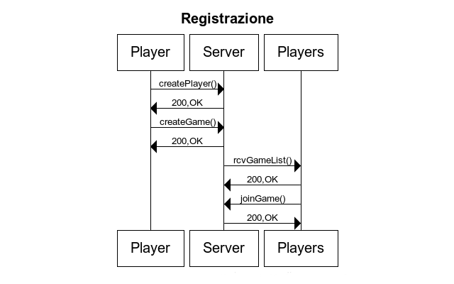
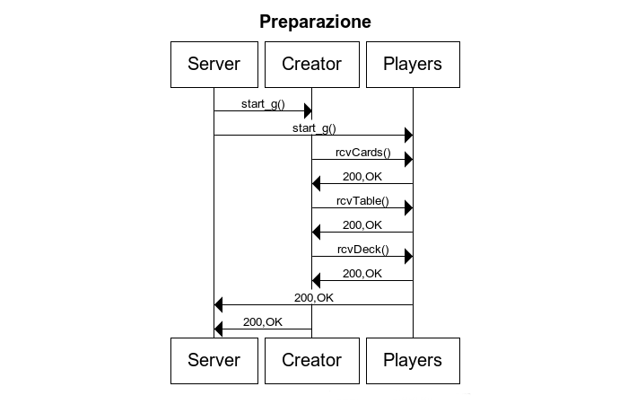
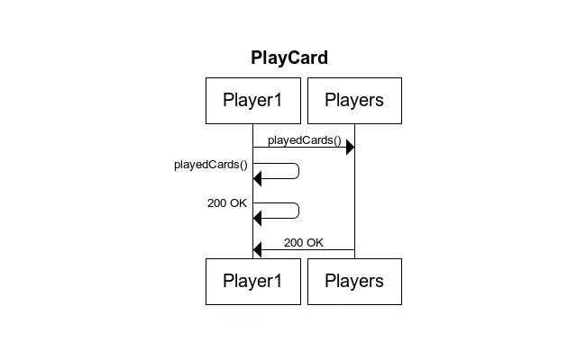
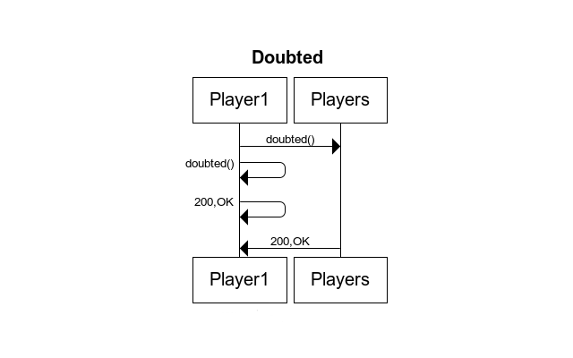
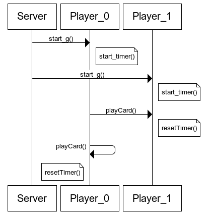
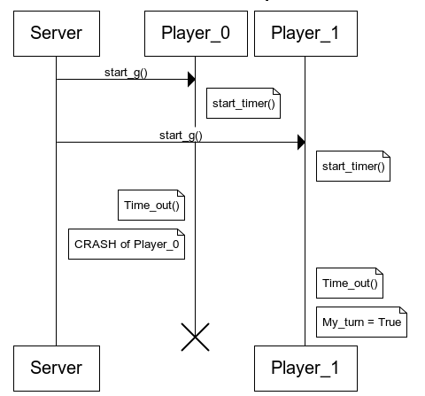

Anno Domini
===========

*Stefano Bettinelli*, *Roberto De Santis*, *Vincenzo Gambale*

###Implementazione di un gioco distribuito basato su un modello architetturale RESTful

## Indice ##

- [Sommario](#sommario)
- [Introduzione](#introduzione)  
- [Aspetti progettuali](#aspetti-progettuali)  
	- [Interazione dei componenti del sistema](#interazione-dei-componenti-del-sistema)
	- [Tolleranza ai guasti](#tolleranza-ai-guasti)
- [Aspetti implementativi](#aspetti-implementativi)  
- [Valutazioni](#valutazioni)  
- [Conclusioni](#conclusioni)

##Sommario##
Il progetto Anno Domini trae spunto da un gioco di carte omonimo che combina l'idea di base di ordinare una sequenza di elementi, tipica del Domino, con la successione cronologica di alcuni eventi storici. 

Il gioco non prevede nessun elemento di perno, ossia specifici ruoli ricoperti da un unico componente del gioco preso in esame (quale potrebbe essere quello del dealer nel Blackjack). Il che, evidentemente, rende Anno Domini particolarmente coniugabile con i paradigmi caratteristici dei sistemi distribuiti. 

In questa relazione descriviamo in che modo è stato ideato e progettato tale sistema distribuito. Assumiamo la presenza solo di guasti di tipo crash dei processi, ossia dei giocatori partecipanti alla partita. Il sistema è stato implementato facendo riferimento al modello architetturale di tipo REST.

##Introduzione##
Anno Domini prevede la partecipazione di un minimo di quattro giocatori alla partita, ad ognuno dei quali vengono distribuite sette carte. Ogni carta rappresenta uno specifico evento storico, visibile ai giocatori anche quando questa è coperta. Quando la carta viene scoperta, viene invece esternato l'anno di riferimento. Come già accennato, lo scopo del gioco è quello di mettere in ordine cronologico, dal più lontano al più recente, gli eventi storici e vince il giocatore che rimane senza carte in mano.

Inizialmente sul banco è presente una sola carta coperta. Man mano che si va avanti con il procedere del gioco, la sequenza presente sul banco si arricchisce di nuove carte, opportunamente posizionate dai giocatori rispettando i turni.

Ogni partecipante alla partita può scegliere di effettuare due tipi diversi di giocate, a seconda del fatto che egli possa ritenere corretta o errata la sequenza di carte posizionate fino a quel momento sul banco. Se ritiene che sia corretta, può giocare la prossima carta, scegliendola dalla propria mano e ponendola all'interno della sequenza nel banco. Mentre se crede che la successione delle carte comuni sia sbagliata, può dubitare: ciò determina la rivelazione delle date degli eventi storici presenti sul banco. In tal caso, se la successione risulta errata il giocatore precedente dovrà pescare tre carte e il giocatore che aveva dubitato potrà giocare una sua carta. Di contro, se la successione risulta corretta lo stesso giocatore che aveva dubitato deve pescare due carte e il turno passerà al giocatore successivo.

La partita termina nel momento in cui un giocatore rimane senza nessuna carta in mano a patto che la sequenza sul banco sia corretta. Infatti, se un giocatore esaurisce le proprie carte, ma la sequenza non risulta corretta, deve pescare due carte del mazzo; il gioco riprende quindi dal partecipante successivo.

La tecnologia REST è inizialmente nata per permettere a servizi web di rilasciare proprie API mantenendo HTTP come protocollo cardine. Solo successivamente ci si sta rendendo conto del fatto che può essere impiegato per la realizzazione dei sistemi distriubuiti. La nostra scelta è ricaduta su REST proprio per sperimentare questo nuovo modo di creare sistemi distribuiti.

##Aspetti progettuali##
Il primo problema che si incontra nel realizzare un sistema distribuito è fare in modo che ogni nodo sia consapevole della costituzione del sistema di cui fa parte. Per una mera questione di semplicità è stato impiegato un *Registrar Server*, dedicato alla registrazione dei nodi. Dunque, i vari componenti del sistema distribuito si iscrivono presso il server in qualità di giocatori, per poi prendere parte alla partita. Nel momento in cui viene raggiunto il numero di giocatori richiesto, la partita può iniziare. Da questo momento in poi il Registrar Server non è più necessario: il sistema distribuito appena creatosi è in grado di auto-gestirsi senza più ricorrere all'ausilio del Registrar.

Nel dettaglio, la fase preliminare per poter dare il via al gioco è strutturata come segue: i giocatori si registrano presso il server scegliendo uno username univoco. Uno dei potenziali giocatori crea un nuovo gioco, specificando il numero di partecipanti desiderato: ci riferiremo a tale giocatore come *creator*. Gli altri nodi si iscrivono al gioco presso il Registrar Server: nel momento in cui viene raggiunto il numero desiderato di giocatori, la partita può iniziare. Quindi il server informa, tramite un apposito messaggio, tutti gli iscritti alla partita: da questo momento in poi il Registrar non sarà più utilizzato.
Per assegnare il primo turno del gioco sarebbe necessario, in teoria, l'utilizzo di un algoritmo distribuito per deciderlo, analogo a quello di elezione del leader. In realtà non c'è un concreto bisogno di tale passaggio poiché si può assumere che il primo turno spetti al creator della partita.

A questo punto, i nodi sono in grado di gestire autonomamente il gioco durante la sua evoluzione. Quando un giocatore deve effettuare una giocata (sia che essa sia un dubbio, sia che si tratti della giocata di una carta), invia un messaggio in broadcast a tutti gli altri. Quest'approccio consente a tutti i partecipanti della partita di mantenere le risorse di gioco aggiornate poiché sono dislocate in modo distribuito.

Considerate le caratteristiche dello scenario, l'architettura astratta del sistema distribuito è quella ad anello. I turni, così come le risorse del gioco, quali il mazzo o le carte presenti sul banco, vengono gestite in modo distribuito. Ciò vuol dire che tali informazioni sono replicate su più nodi, in modo da poter tollerare eventuali guasti dei processi senza compromettere il prosieguo del gioco.

##TODO##
serve uno schema dell'architettura?

Come già detto, le caratteristiche del gioco consentono un'agevole realizzazione mediante un sistema distribuito. Infatti la mancanza di un componente di controllo centralizzato e l'indipendenza dei nodi costituiscono, se vogliamo, un denominatore comune per il gioco e il mondo dei sistemi distribuiti. 

La scelta della tecnologia impiegata con cui è stato realizzato il nostro sistema distribuito è ricaduta su REST. Allo stato dell'arte sembra essere molto sfruttata: basta per esempio considerare alcuni punti di riferimento in questo campo, come Amazon e Google, che stanno attualmente adottando questo modello architetturale.

###Interazione dei componenti del sistema###
Vediamo ora da un punto di vista progettuale come abbiamo deciso di realizzare la comunicazione dei vari elementi che compongono il sistema. In particolare vengono descritte le fasi di registrazione, preparazione, svolgimento di una giocata e di dubbio.

Prima di iniziare il gioco, un giocatore deve registrarsi al Registrar Server. La registrazione avviene inviando un messaggio di `createPlayer` a quest'ultimo . Dopo la registrazione, il giocatore può creare una nuova partita specificando anche il numero di giocatori desiderato oppure unirsi ad una già esistente mediante il messaggio joinGame. Una volta creata la partita il server informa tutti i giocatori inviando il messaggio rcvGameList.

Nel momento in cui il numero di giocatori richiesto dal creatore è raggiunto, nessun altro utente potrà più iscriversi alla partita in questione: il server invia a tutti i partecipanti il messaggio di startGame, contenente la lista dei giocatori, per comunicare l’inizio della partita.
Come già ancitipato in precedenza, sarebbe necessario utilizzare un algoritmo analogo a quello di elezione del leader per stabilire quale giocatore tra i partecipanti avrà il turno. Poiché esiste un solo creatore, per semplicità, abbiamo assunto che sia quest'ultimo il primo. Dunque, quando il creatore riceve il messaggio startGame, a differenza degli altri giocatori, distribuisce le carte attraverso il messaggio rcvCards, per poi distribuire la configurazione del tavolo (inizialmente costituito da una sola carta) usando il messaggio rcvTable e il mazzo restante (messaggio rcvDeck). Precisiamo il fatto che, mentre la distribuzione delle carte e del tavolo è un'operazione fondamentale per il gioco, l'invio a tutti del mazzo viene fatta per un motivo legato alla tolleranza ai guasti. Infatti, se così non fosse, il guasto del singolo nodo che detiene il mazzo impedirebbe agli altri partecipanti di continuare il gioco.

Quando un giocatore gioca una carta viene inviato un messaggio playedCard in broadcast a tutti i giocatori (compreso sè stesso).

Analogamente, quando un giocatore dubita viene inviato in broadcast un messaggio doubted. Tutti i nodi che ricevono questo messaggio eseguono la computazione del dubbio in locale, verificando se il dubbio era fondato o meno: in tal modo ogni nodo stabilisce quale giocatore deve pescare le carte di penalizzazione e assegna il turno relativo alla giocata successiva. Tale operazione consente di mantenere il sistema in uno stato coerente: aggiornando localmente i contatori del numero di carte degli altri giocatori.

##Tolleranza ai guasti
I guasti che tollera il nostro sistema sono di crash dei nodi che possono presentarsi dopo che una partita è stata avviata, eventuali guasti del Registrar Server non vengono gestiti: si assume che il suo funzionamento sia perfetto. Si suppone inoltre che la rete sottostante sia affidabile: l'invio e la ricezione dei messaggi avviene in modo corretto ed entro un tempo ragionevole.

Di conseguenza, risolvere il problema della tolleranza ai guasti si traduce principalmente nell'identificare i nodi che vanno in crash, per poi adottare una specifica politica che permetta agli altri giocatori di continuare a giocare. Per convenzione, abbiamo stabilito che una partita può continuare finché sono presenti almeno quattro giocatori.

Abbiamo evitato soluzioni in cui i nodi si scambiano messaggi di liveness, i quali avrebbero aumentato la complessità del funzionamento del singolo nodo ed aumentato il numero di messaggi in circolo sulla rete. Il nostro approccio, invece, fa uso di un timer, presente su ogni nodo, il quale viene avviato nel momento in cui la partita ha inizio e riavviato quando viene passato il turno. La scadenza imposta dal timer definisce il tempo limite entro il quale il giocatore in possesso del turno deve effettuare la giocata. Poiché non sono tollerati guasti di omissione (quale potrebbe essere la mancata giocata da parte del player di turno), abbiamo assunto che ogni giocata avviene prima che il timer scada. Inoltre, non tollerando nemmeno guasti relativi alla rete, il messaggio riguardante la giocata sarà ricevuto correttamente dagli altri partecipanti. Riassumendo, con la scadenza del timer su un determinato nodo si inferisce che il giocatore da cui ci si aspettava una giocata ha subito un crash. Ovviamente, tutti i nodi sono a conoscenza del giocatore a cui è assegnato il turno in ogni momento.

La politica adottata nel caso in cui viene rilevato un crash permette agli altri nodi rimasti di continuare il gioco. Per il momento, ipotizziamo che tutti i nodi abbiano i timer sincronizzati (cosa che, in realtà, non è). Nel momento in cui il timer scade, tutti i nodi rimuovono dalla propria lista dei partecipanti il giocatore da cui ci si aspettava la giocata. Tale rimozione, comunque, è trasparente rispetto al passaggio del turno: subito dopo il rilevamento del crash, il turno sarà assegnato al giocatore successivo. Dunque, il sistema distribuito non risente alcun effetto negativo derivante dal crash, se non il fatto che le carte che il nodo eliminato aveva in mano, prima che si manifestasse il malfunzionamento, vengono perse. &Egrave; importante notare che il crash di un nodo viene rilevato soltanto nel momento in cui il turno sarà ad esso assegnato. Infatti, se un nodo facesse crash quando non detiene il token, la mancata rilevazione istantanea da parte degli altri nodi non compromette nemmeno in minima parte il funzionamento del sistema. Dunque, soltanto quando arriverà il turno di tale nodo verrà attivato il relativo timer, che scadrà: la mancata giocata permetterà agli altri nodi del sistema di rilevare il crash. Ovviamente, se a causa di uno o più crash, il numero di nodi dovesse risultare minore del minimo consentito (4), il gioco verrà interrotto.

Come già anticipato, in realtà i timer che permettono di rilevare un'eventuale malfunzionamento del giocatore di turno non sono sincronizzati. Infatti, nonostante la rete sia affidabile, non è possibile assumere che un messaggio relativo ad una giocata effettuata arrivi nello stesso istante ai vari destinatari. Di conseguenza, il timer relativo al prossimo player di turno partirà in istanti lievemente distanziati uno dall'altro sui vari nodi. Ma in uno scenario del genere, se il giocatore che detiene il token effettua la giocata allo scadere del tempo limite, si rischia che alcuni nodi accettino correttamente tale giocata, mentre in altri è già scaduto il timer, sfociando in una situazione di incosistenza del sistema: qualcuno ha rilevato un crash che non si è manifestato. Per risolvere tale problema, abbiamo adottato un timer aggiuntivo, attivo esclusivamente sul giocatore di turno, il quale ha una scadenza più breve (di 5 secondi, ad esempio), oltre cui non è più consentito effettuare una giocata. Così facendo, la differenza di tempo tra il timer relativo alla possibilità di giocare installata sul giocatore di turno e quello relativo al crash detection, consente, in virtù del corretto funzionamento della rete, che i messaggi arrivino prima di un eventuale rilevamento fittizio di crash. 

Vediamo ora nelle specifico il funzionamento del timeout relativo al crash all'interno del nodo in due casi diversi: 

- Il server comunica ai giocatori che possono iniziare la partita: essi fanno partire il timer di crash detection. Il giocatore a cui spetta il turno effettua una giocata entro il tempo limite del proprio turno, ed invia a tutti gli altri partecipanti un messaggio dell'azione effettuata. Alla ricezione di tale messaggio gli altri giocatori, a loro volta, resettano il timeout; automaticamente il turno viene calcolato in ogni nodo ed assunto univocamente da uno dei giocatori.

- Il server invia la start_game ai nodi, i quali fanno partire il timer. Poiché ha subito un crash, il giocatore player_0 non effettua alcuna giocata entro il tempo limite. Questo evento provoca lo scadere del timeout sugli altri nodi che rilevano il malfunzionamento ed eliminano il giocatore in questione della lista dei partecipanti. Il turno quindi passerà automaticamente al giocatore successivo.

##Aspetti implementativi##

Linguaggi usati

lato server:

- python	2.7
- Flask: un microframework che permette la creazione di applicazione web con Python

lato client:

- javascript
- html
- css

Il sistema si compone di tre elementi principali

- Il Server di Registrar, implementato nel file server.py,  offre i seguenti servizi REST al player_server.

| Metodo | HTTP Request | Descrizione servizio |
|--------|:------------:|---------------------:|
| `get_players()` | GET `/playerList` | Restituisce la lista dei giocatori iscritti al server |
| `get_games()` | GET `/gameList` | Restituisce la partita attiva sul server |
| `create_p(username, porta)` | POST `/createPlayer/<string:username>/` `<int:porta>` | Crea un nuovo giocatore all'interno del sistema  |
| `create_g(username, n_players)` | POST `/createGame/<string:username>/` `<int:n_players>` | Restituisce la lista dei giocatori iscritti al server |
| `join_g(username, game_id)` | PUT `/joinGame/<string:username>/` `<int:game_id>` | Permette ad un player la partecipazione ad una partita esistente se non è stato già 	raggiunto il numero di giocatori impostato al momento della creazione della partita |

- Il Player server è implementato nel file player_server.py ed implementa la logica di un singolo giocatore. Offre i seguenti servizi REST.

| Metodo | HTTP Request | Descrizione servizio |
|--------|:------------:|---------------------:|
| `game_status()` | GET `/gameStatus` | Permette di conoscere lo stato del gioco, cioè se la partita è iniziata oppure no |
| `doubt_status()` | POST `/doubtStatus` | Permette di controllare se è stato sollevato un dubbio |
| `create_p()` | GET `/createPlayer/<string:username>` | Richiede la creazione di un nuovo giocatore sul server |
| `gameList()` | GET `/gameList` | Restituisce la lista delle partite |
| `create_g(n_players)` | POST `/createGame/<int:n_players>` | Crea una partita sul server |
| `join_g()` | PUT `/joinGame/<int:id_game>` | Effettua la join in una partita del server |
| `start_g()` | GET `/startGame` | Servizio richiamato dal Server di Registrar per iniziare una nuova partita |
| `rcvCards()` | POST `/receiveCards` | Permette di ricevere le carte da gioco |
| `rcvTable()` | POST `/receiveTable` | permette di ricevere le carte sul banco |
| `rcvDeck()` | POST `/receiveDeck` | Permette di ricevere il mazzo |
| `playedCard(username, year,` ` event, card_id, position)` | PUT `/playedCard/<string:username>/` `<int:year>/<string:event>` `/<int:card_id>/<int:position>` | permette di ricevere la giocata di uno dei partecipanti |
| `doubted(username)` | PUT `/doubted/<string:username>` | permette di ricevere un'azione di dubbio sollevata da uno dei giocatori |

La GUI è implementata nel file gui.html. L'interfaccia grafica per il suo funzionamento ha bisogno dei servizi implementati nel player_server.py ed utilizza tecniche di polling standard per poter ricevere i cambiamenti di stato di una sessione di gioco. Ad esempio, si effettua polling per monitorare stato del turno oppure un possibile stato di dubbio sulla sequenza di carte del banco; l'obiettivo del progetto non era quello di creare un'interfaccia grafica sofisticata e anche questa descrizione è sufficiente.

##Valutazioni##

##Conclusioni##
